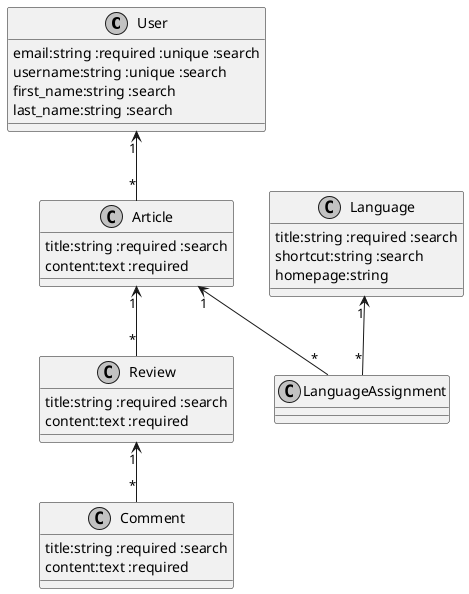

# Generate new scaffold steps

generate spec/system/admin

rails generate model Review title content:text
- `db/migrate/xxxxxxxxx_create_reviews.rb`
- `app/models/review.rb (attributes, required, search)`
- `spec/models/review_spec.rb (attributes, required)`
- `spec/factories/reviews_spec.rb` (traits)

rails generate request Review
- `spec/requests/admin/reviews_request_spec.rb`
- `config/routes.rb` ("resources :articles, concerns: %i[searchable]", after: "namespace :admin do")
- `app/controllers/admin/reviews_controller.rb`
- `app/presenters/review_presenter.rb`
- `app/views/admin/reviews`
- `app/components/forms/reviews_form_component.html.slim`
- `app/components/forms/reviews_form_component.html.rb`

