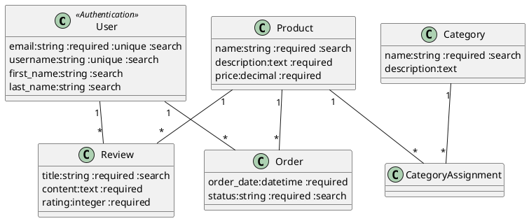

# Blogger model diagram in UML

```plantuml
@startuml

class User <<Authentication>> {
  email:string :required :unique :search
  username:string :unique :search
  first_name:string :search
  last_name:string :search
}

class Product {
  name:string :required :search
  description:text :required
  price:decimal :required
}

class Order {
  order_date:datetime :required
  status:string :required :search
}

class Review {
  title:string :required :search
  content:text :required
  rating:integer :required
}

class Category {
  name:string :required :search
  description:text
}

User "1" -- "*" Order
User "1" -- "*" Review

Product "1" -- "*" CategoryAssignment
Category "1" -- "*" CategoryAssignment

Product "1" -- "*" Review
Product "1" -- "*" Order

@enduml
```
